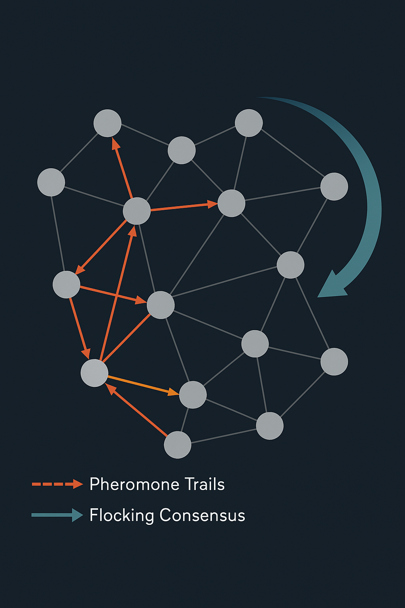

<h1 align="center">SwarmRoute: Bio‑Inspired Routing &amp; Load Balancing</h1>

<p align="center">
  
</p>


<p align="center"><strong>“We mathematically ensured that in degraded conditions, the expected pheromone update for a failing/slow endpoint is negative, so its probability mass decays over time, while fast/healthy endpoints gain mass.”</strong></p>


## Overview

SwarmRoute is a lightweight sidecar and library that applies principles from swarm intelligence to service discovery, routing, and load balancing. Each instance in your microservice mesh runs its own SwarmRoute agent which maintains pheromone tables and participates in a simple local consensus process. These agents reinforce paths that lead to low latency and high reliability while forgetting stale or degraded routes. Rather than relying on a single control plane, SwarmRoute lets the system heal and adapt itself when services appear, disappear, or become congested.

This project grew out of research into ant colony optimisation, negative pheromone strategies, and flocking dynamics. Ants balance exploration and exploitation through pheromone deposition and evaporation. Some algorithms even deposit negative pheromone on poor solutions ([pmc.ncbi.nlm.nih.gov](https://pmc.ncbi.nlm.nih.gov)). Modern service‑composition algorithms use multiple pheromone species to encode different quality‑of‑service metrics ([Journal of Cloud Computing](https://journalofcloudcomputing.springeropen.com)). Meanwhile, studies on heterogeneous flocks show that assigning different feedback gains to agents yields faster consensus and greater robustness ([Nature](https://www.nature.com)). SwarmRoute distills these ideas into a pragmatic routing engine for cloud services and event‑driven systems.


## Table of Contents

- [Overview](#overview)
- [Features](#features)
- [Quick Start](#quick-start)
- [Architecture](#architecture)
- [Research and Inspiration](#research-and-inspiration)
- [Roadmap](#roadmap)
- [Contributing](#contributing)
- [License](#license)


## Features

- Bio‑inspired adaptive routing — Each agent chooses destinations using a weighted pheromone table that favours endpoints with low latency and high success rates. Pheromone values evaporate over time to forget stale information. A configurable exploration factor ensures that a fraction of requests probe alternative paths.

- Negative and multi‑pheromone reinforcement — SwarmRoute penalises failed or slow calls by subtracting pheromone from the offending route, implementing a negative reinforcement mechanism inspired by TrailMap ([pmc.ncbi.nlm.nih.gov](https://pmc.ncbi.nlm.nih.gov)). For multi‑criteria routing, separate pheromone tables track different QoS metrics (e.g., latency, error rate, cost); they are combined with tunable weights as proposed in multi‑attribute ant algorithms ([Journal of Cloud Computing](https://journalofcloudcomputing.springeropen.com)).

- Local consensus and heterogeneity — Agents periodically exchange pheromone summaries with a handful of neighbours and nudge their tables toward the neighbourhood consensus. Heterogeneity in update rates and weighting factors improves convergence and robustness under communication delays ([Nature](https://www.nature.com)).

- Scalable sidecar architecture — The library runs alongside your service or as a sidecar container. There is no central controller; all state is local except for occasional gossip. Evaporation and updates run in their own goroutines to avoid blocking request threads.

- Telemetry hooks — SwarmRoute exposes endpoints for scraping the current pheromone tables and consensus state. Operators can visualise emergent “pheromone maps,” observe cluster‑wide load distribution, and spot anomalies without deep instrumentation.


## Quick Start

1. Install Go — SwarmRoute is written in Go. Make sure you have a recent version of Go installed (tested with Go 1.20 and later).

2. Build SwarmRoute — Fetch the repository and build the library (note: use three dots `...`, not two `..`):

```bash
git clone https://github.com/your-org/swarmroute.git
cd swarmroute
go build ./...
```

3. Run the example app — A minimal runnable entrypoint lives under `cmd/swarmroute`:

```bash
go run ./cmd/swarmroute
```

You should see a line like:

```
Selected endpoint: http://localhost:8081
```

3. Integrate with your service — Add SwarmRoute as a dependency in your service module. Initialise a new SwarmRoute instance on startup, register your service and its endpoints, then call `PickEndpoint(serviceName)` to select a destination for each request. After the call completes, invoke `ReportResult(serviceName, endpoint, latency, success)` to update pheromones. See the examples in `examples/` for details.

4. Configure — Tune parameters such as pheromone evaporation rate, exploration rate, weights for different metrics, negative reinforcement magnitude, and gossip interval through configuration files or environment variables.

5. Run — Deploy the sidecar alongside each microservice instance. Ensure that each agent can reach its neighbours to exchange gossip. Monitor the provided metrics endpoint to observe how pheromone values evolve over time.


## Architecture

SwarmRoute is centred around a concurrent‑safe `SwarmRoute` type. Internally, it maintains a map from `(serviceName, endpoint)` to a vector of pheromone values. Each vector holds one or more pheromone “species,” such as latency, error, cost, etc. Pheromone updates follow this general pattern:

- Positive update — After a successful call, increase the pheromone values for the chosen endpoint in proportion to its performance (e.g., lower latency yields a larger increment). Other endpoints receive no update.
- Negative update — On failure or unacceptable latency, subtract pheromone from the offending endpoint to discourage its future selection ([pmc.ncbi.nlm.nih.gov](https://pmc.ncbi.nlm.nih.gov)).
- Evaporation — At a fixed interval, multiply all pheromone values by a decay factor to allow the system to forget stale information.
- Selection — To pick an endpoint, compute a weighted sum of pheromone species (according to the chosen QoS profile) and sample endpoints proportionally to their weighted value. A small epsilon ensures random exploration.
- Consensus — Periodically, each agent gossips a compressed version of its pheromone tables to a small subset of peers. Agents update their tables by partially averaging with neighbours, implementing a consensus dynamics reminiscent of flocking. Introducing heterogeneous gains across agents improves stability when delays and obstacles exist ([Nature](https://www.nature.com)).

This design draws on insights from multi‑colony ant algorithms, which use multiple parameter sets and inter‑colony cooperation to avoid premature convergence ([SpringerLink](https://link.springer.com)). Similarly, SwarmRoute supports partitioning the service graph into “colonies” (e.g., by region) that occasionally exchange pheromone summaries.


## Research and Inspiration

SwarmRoute’s design is informed by a range of studies:

- Negative pheromone and selective reinforcement — The TrailMap peer‑matching system uses positive pheromone for helpful interactions and deposits negative pheromone for unhelpful helpers, thereby discouraging poor routes while still allowing exploration ([pmc.ncbi.nlm.nih.gov](https://pmc.ncbi.nlm.nih.gov)). SwarmRoute adopts a similar mechanism to penalise unreliable endpoints.

- Multi‑pheromone species for QoS — Modern service composition frameworks maintain separate pheromone tables for different metrics (latency, response time, energy) and combine them with weights to prioritise the primary requirement while balancing others ([Journal of Cloud Computing](https://journalofcloudcomputing.springeropen.com)). SwarmRoute generalises this idea, allowing you to register any number of pheromone species.

- Heterogeneity for faster convergence — Research on mixed‑agent flocks shows that assigning different feedback gains to each agent can significantly improve consensus rate and resilience under time delays ([Nature](https://www.nature.com)). We apply this by letting agents choose different evaporation rates and gossip weights.

- Multi‑colony strategies — Multi‑colony ant algorithms combine heterogeneous colonies with cooperative information sharing to improve solution quality and avoid premature stagnation ([SpringerLink](https://link.springer.com)). SwarmRoute encourages partitioning large meshes into subgroups that occasionally exchange pheromone summaries.

- Time delay and obstacle avoidance — Studies of flocking dynamics with delays and obstacle repulsion show that delays can suppress alignment and that repulsive potentials around obstacles accelerate singularities ([Frontiers in Applied Mathematics and Statistics](https://www.frontiersin.org)). These insights motivate SwarmRoute’s bounded gossip intervals and safe default behaviours when network latency or partitions occur.


## Roadmap

- Pluggable QoS heuristics — Integrate external metrics (e.g., cost per call, carbon footprint) into pheromone updates.
- Adaptive weight learning — Automatically adjust weights on pheromone species based on observed service‑level objectives.
- Visualization dashboard — Provide a dashboard that overlays pheromone maps on service topology and displays local consensus metrics.
- Language bindings — Add bindings for Rust, JavaScript/Node.js, and other ecosystems.
- Simulation tools — Extend the `examples/` directory with more complex simulations (heterogeneous agents, time delays, obstacles) to help users tune parameters.


## Contributing

Contributions are welcome! Please fork the repository, create a feature branch, and submit a pull request. Contributions could include bug fixes, new features, integration with service meshes, documentation improvements, or experiments.


## License

This project is licensed under the MIT License. See the LICENSE file for details.
